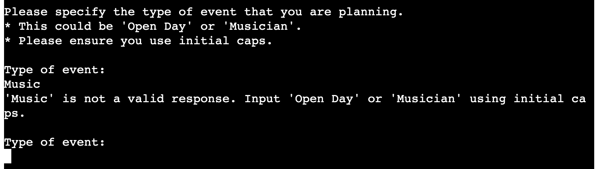
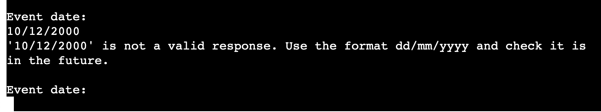
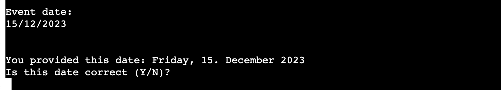
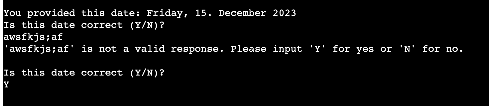
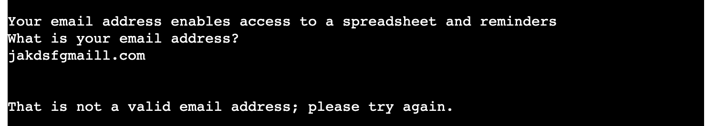
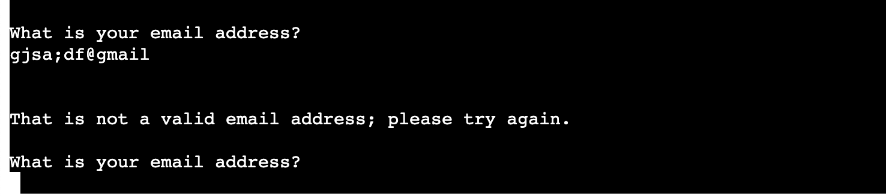
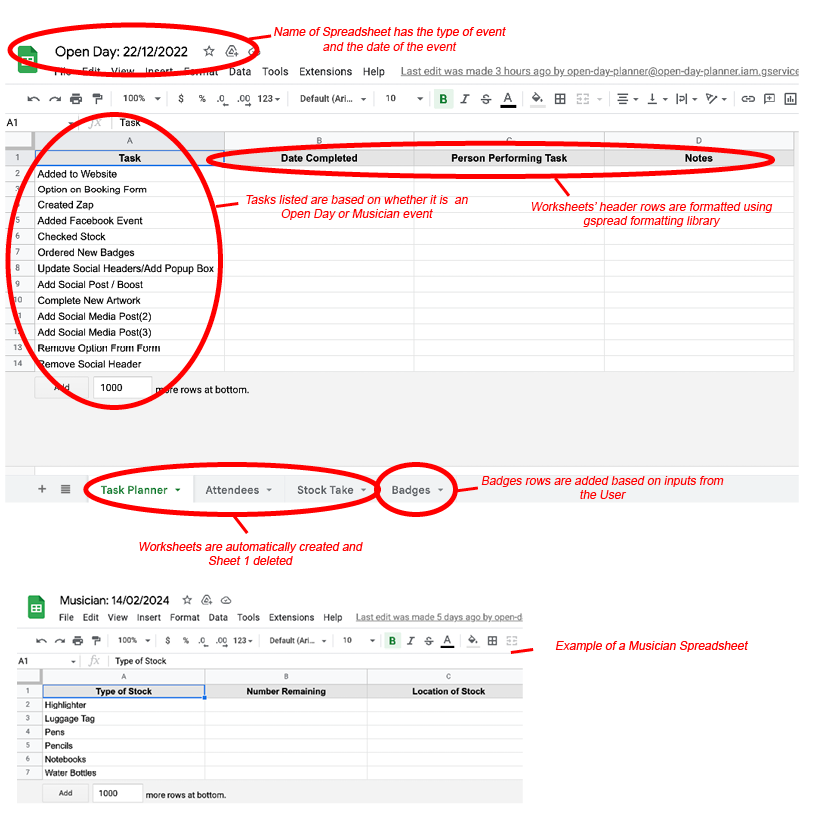

# Open Day Planner

## Overview

This site is designed specifically to help my colleagues and me to save time and be more efficient when implementing the marketing plan of certain events we offer through our work. Adding the type and date of the event will result in a Google spreadsheet for the event (containing a Tasks planner and other worksheets to update) as well as a series of calendar reminders that get entered in at a date relative to the date of the event itself. Historically we have sometimes forgetten to do the odd task but at the same time do not have the time to manually add in a long series of reminders either; this programme addresses these issues. Whilst the main content is overall designed to add efficiency to my work, for the purpose of this project a few modications were made to 1 maintain anonymity 2 make the project more complex (adding staff name badges and the option of choosing different types of events) and 3 not have calendar entries and spreadsheets added by external site users to our actual email accounts (for example, instead of adding attendees from my work, the user needs to enter their email address instead, and the calendar creation is done through a test email I created for this purpose).

Should someone else want to use it to plan their event, they could use the basic framework by <a href="https://docs.github.com/en/get-started/quickstart/fork-a-repo" target="new" aria-label="How to fork a repo - opens in a new window">making a fork for the github repository</a> and then using that to make modifications to the types of events allowed, panda dataframes, and calendar descriptions/timeframes to create their own useful planning system.

## Flowchart

## Features

<strong>Type of event verification:</strong> The programme checks the user input either "Prep" or "Open Day"

<strong>Date verification:</strong> The programme checks the user input a date using dd/mm/yyyy format and that the date is in the future. It then returns the date in a user-friendly format so the user can verify that the date is correct. If not, they are asked to input the correct date.

<strong>Email verification:</strong> The programme checks the user input a valid email address.

<strong>Spreadsheet creation:</strong> A Google spreadsheet is created to help plan the event based on the type of event the user input using the Panda dataframes for data.

<strong>Name badges:</strong> The programme allows the user to add the information of any new staff who need badges into the system with the information populated formatted as all caps and added as a new row in the Badges worksheet (Open Day event only). It ensures that a response is given for each input.

<strong>Calendar reminders:</strong> The programme automatically creates a series of reminders to help the user to remember what they have to do at a particular date in relation to the date of the event. The reminders cannot be in the past or fall on a weekend.

<strong>Print reminders:</strong> The programme automatically creates a series of print statements to remind the user what they need to do now. They are done with a delay to make sure the user has a chance to read them.

## Testing

At each stage, I tested to ensure that each validation produced the expected result (e.g., intentionally adding dates in the past, wrong type of event, wrong email format, etc), either looping to ask the user for a correct input with the appropriate error or progressing the user through the programme if the input was correct. 

I checked to ensure the spreadsheets were in a clear, usable format with the cells labeled as expected and headers formatted.

I also went through the 'Problems' section of the console and the pycodestyle to ensure there were no errors. I found that it didn't like the escape character in the email validation. A search found that adding an 'r' before the string made the program ignore that character and pass the test. The 80 character line length also caused problems until a search found that an escape character at the end of the line would split the lines and make them still work.

I also checked for user experience. In particular, I noticed that the programme seemed to be paused (or even broken) when the spreadsheet was being created as it took some time to generate. I therefore added the print message "Please be patient as the spreadsheet is created...". I also noticed that the multiple print statements at the end came out too fast and could be easily missed so I added a pause between statements using asyncio. In general, I also tested the input specifications to ensure that the instructions are clear from the outset and that any error messages resulting from incorrect input are helpful so the user can enter a valid response.

### Validator Testing
<strong>pycodestyle (formerly called pep8)</strong>: No errors were returned when passing through the <a href="https://pypi.org/project/pycodestyle/#:~:text=pycodestyle%20is%20a%20tool%20to,style%20conventions%20in%20PEP%208.&text=This%20package%20used%20to%20be,to%20pycodestyle%20to%20reduce%20confusion." target="new" aria-label="Info about Pycodestyle; opens in a new window">pycodestyle validator</a> once the line length, trailing whitespaces, double space above functions and escape character issues were resolved. I ran pycodestyle by running "pip install pycodestyle" in the terminal and then "pycodestyle --first run.py"

## Deployment
The site was deployed to Heroku. The steps to deploy are as follows:
<ol>
<li>Create a new app in Heroku</li>
<li>Add Config Vars for creds.json, credentials.json and Port 8000 </li>
<li>Add Buildpacks for python and nodejs (in that order)</li>
<li>Deploy by connecting to the Github repository</li>
<li>Set up automatic deploys</li>
</ol>
The live link can be found here <a href="https://open-day-planner.herokuapp.com/" target="new" aria-label="Open Day Planner in Heroku (opens in new window)">https://open-day-planner.herokuapp.com/</a>

## Credits

### Working with dates:
<ul><li><a href="https://theprogrammingexpert.com/check-if-string-is-date-in-python/#:~:text=To%20check%20if%20a%20string,string%20and%20a%20date%20format.&text=When%20working%20with%20strings%20in,date%20can%20be%20very%20useful" aria-label="The programming expert website (opens in a new window)" target="new">Programming Expert Website: checking input is a date in Python</a></li>

<li><a href="https://theprogrammingexpert.com/python-remove-time-from-datetime/#:~:text=To%20remove%20the%20time%20from,a%20date%20using%20date().&text=You%20can%20also%20use%20strftime,datetime%20object%20without%20the%20time" aria-label="The programming expert website (opens in a new window)" target="new">Programming Expert Website: removing time from Datetime</a></li>

<li><a href="https://stackoverflow.com/questions/7239315/cant-compare-datetime-datetime-to-datetime-date" aria-label="Stack Overflow website (opens in a new window)" target="new">Stack Overflow Website: comparing datetime-datetime to datetime-date</a></li>

<li><a href="https://docs.python.org/3/library/datetime.html#datetime.datetime.weekday" aria-label="Python.org website (opens in a new window)" target="new">Python.org: getting weekday from date</a></li>
</ul>

### Email validation:
<ul><li><a href="https://www.tutorialspoint.com/python-program-to-validate-email-address" aria-label="Tutorials Point website (opens in a new window)" target="new">Tutorials Point Website: validating email address</a> <em>(this produces an error in pycodestyle)</em></li>

<li><a href="https://www.includehelp.com/python/ignoring-escape-sequences-in-the-string.aspx#:~:text=To%20ignoring%20escape%20sequences%20in,%22r%22%20before%20the%20string." aria-label="Include Help website (opens in a new window)" target="new">Include Help website: how to ignore escape character in a string</a> <em>(this fixes error in pycodestyle from above)</em></li>
</ul>

### Working with Google Sheets and Pandas
<ul><li><a href="https://medium.com/@jb.ranchana/write-and-append-dataframes-to-google-sheets-in-python-f62479460cf0" aria-label="Medium website (opens in a new window)" target="new">Medium Website: append dataframes to Google Sheets</a></li>

<li>Love Sandwiches Github Project: Credentials Code</a></li>

<li><a href="https://github.com/robin900/gspread-formatting" aria-label="Github website (opens in a new window)" target="new">Github (robin900): formatting Google spreadsheet through Python</a></li>

<li><a href="https://www.digitalocean.com/community/tutorials/update-rows-and-columns-python-pandas" aria-label="Digital Ocean website (opens in a new window)" target="new">Digital Ocean: updating rows and columns using pandas</a></li>

<li><a href="https://docs.gspread.org/en/latest/user-guide.html" aria-label="Gspread Userguide website (opens in a new window)" target="new">Gspread User Guide: general reference for using gspread</a></li>
</ul>

### Working with Google Calendar API
<ul><li><a href="https://developers.google.com/calendar/api/v3/reference/events/insert" aria-label="Google Developers Website (opens in a new window)" target="new">Google Developers Website: inserting events</a></li>

<li><a href="https://developers.google.com/workspace/guides/configure-oauth-consent" aria-label="Google Developers Website (opens in a new window)" target="new">Google Developers Website: Oauth Consent</a></li>
</ul>

### Working with Asyncio
<ul><li><a href="https://docs.python.org/3/library/asyncio.html" aria-label="Python.org Website (opens in a new window)" target="new">Python.org: asyncio</a></li></ul>

## Python Libraries Used

<ul><li><strong>datetime, date, timedelta: </strong>Enables users to check an input was a valid date, find the date/time now, add/subtract units of time from a date</li>
<li><strong>re: </strong>Enables the program to check whether a string was a valid email address</li>
<li><strong>asyncio: </strong>Enables the programme to add a pause inbetween print statements</li>
<li><strong>gspread: </strong>Enables the programme to link to Google Sheets</li>
<li><strong>google.oauth2.service_account import Credentials: </strong> Enables the programme to link to Google Calendar</li>
<li><strong>pandas as pd: </strong> Enables the creation of dataframes</li>
<li><strong>from gspread_dataframe import set_with_dataframe: </strong>Enables user to add panda dataframes to the Google Sheet</li>
<li><strong>from gspread_formatting import *: </strong>Enables users to specify formatting for their Google Sheets within Python</li></ul>