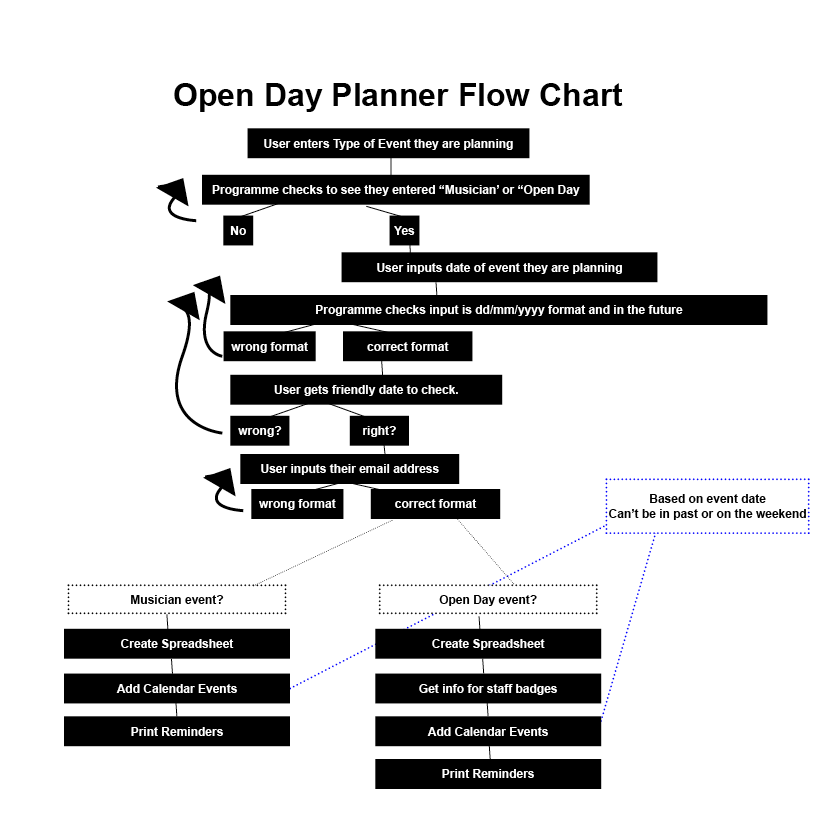

Welcome MandyHole,

This is the Code Institute student template for deploying your third portfolio project, the Python command-line project. The last update to this file was: **August 17, 2021**

## Reminders

* Your code must be placed in the `run.py` file
* Your dependencies must be placed in the `requirements.txt` file
* Do not edit any of the other files or your code may not deploy properly

## Creating the Heroku app

When you create the app, you will need to add two buildpacks from the _Settings_ tab. The ordering is as follows:

1. `heroku/python`
2. `heroku/nodejs`

You must then create a _Config Var_ called `PORT`. Set this to `8000`

If you have credentials, such as in the Love Sandwiches project, you must create another _Config Var_ called `CREDS` and paste the JSON into the value field.

Connect your GitHub repository and deploy as normal.

## Constraints

The deployment terminal is set to 80 columns by 24 rows. That means that each line of text needs to be 80 characters or less otherwise it will be wrapped onto a second line.

-----
Happy coding!

# Open Day Planner

## Overview

This site is designed specifically to help my colleagues and me to save time and be more efficient when implementing the marketing plan of certain events we offer through our work. Adding the type and date of the event will result in a Google spreadsheet for the event (containing a Tasks planner and other worksheets to update) as well as a series of calendar reminders that get entered in at a date relative to the date of the event itself. Whilst the main content is overall designed to add efficiency to my work, for the purpose of this project a few modications were made to 1 maintain anonymity 2 make the project more complex (adding staff name badges and the option of choosing different types of events) and 3 not have calendar entries and spreadsheets added by external site users to our actual email accounts (for example, instead of adding attendees from my work, the user needs to enter their email address instead, and the calendar creation is done through a test email I created for this purpose).

Should someone else want to use it to plan their event, they could use the basic framework and make modifications to the types of events allowed, panda dataframes, and calendar descriptions/timeframes to create their own useful planning system.

## Flowchart

## Features

<strong>Type of event verification:</strong> The programme checks the user input either "Musician" or "Open Day"

<strong>Date verification:</strong> The programme checks the user input a date using dd/mm/yyyy format and that the date is in the future. It then returns the date in a user-friendly format so the user can verify that the date is correct. If not, they are asked to input the correct date.

<strong>Email verification:</strong> The programme checks the user input a valid email address.

<strong>Spreadsheet creation:</strong> A Google spreadsheet is created to help plan the event based on the type of event the user input using the Panda dataframes for data.

<strong>Name badges:</strong> The programme allows the user to add the information of any new staff who need badges into the system with the information populated as a new row in the Badges worksheet (Open Day event only).

<strong>Calendar reminders:</strong> The programme automatically creates a series of reminders to help the user to remember what they have to do at a particular date in relation to the date of the event. The reminders cannot be in the past or fall on a weekend.

<strong>Print reminders:</strong> The programme automatically creates a series of print statements to remind the user what they need to do now. They are done with a delay to make sure the user has a chance to read them.

## Testing

Validator Testing
<strong>pycodestyle (formerly called pep8)</strong>: No errors were returned when passing through the pycodestyle validator

## Deployment
The site was deployed to GitHub pages. The steps to deploy are as follows:
In the GitHub repository, navigate to the Settings tab
From the source section drop-down menu, select the Master Branch
Once the master branch has been selected, the page will be automatically refreshed with a detailed ribbon display to indicate the successful deployment.
The live link can be found here - https://mandyhole.github.io/love-a-lab/

## Credits

### Working with dates:
<ul><li><a href="https://theprogrammingexpert.com/check-if-string-is-date-in-python/#:~:text=To%20check%20if%20a%20string,string%20and%20a%20date%20format.&text=When%20working%20with%20strings%20in,date%20can%20be%20very%20useful" aria-label="The programming expert website (opens in a new window)" target="new">Programming Expert Website: checking input is a date in Python</a></li>

<li><a href="https://theprogrammingexpert.com/python-remove-time-from-datetime/#:~:text=To%20remove%20the%20time%20from,a%20date%20using%20date().&text=You%20can%20also%20use%20strftime,datetime%20object%20without%20the%20time" aria-label="The programming expert website (opens in a new window)" target="new">Programming Expert Website: removing time from Datetime</a></li>

<li><a href="https://stackoverflow.com/questions/7239315/cant-compare-datetime-datetime-to-datetime-date" aria-label="Stack Overflow website (opens in a new window)" target="new">Stack Overflow Website: comparing datetime-datetime to datetime-date</a></li>

<li><a href="https://docs.python.org/3/library/datetime.html#datetime.datetime.weekday" aria-label="Python.org website (opens in a new window)" target="new">Python.org: getting weekday from date</a></li>
</ul>

### Email validation:
<ul><li><a href="https://www.tutorialspoint.com/python-program-to-validate-email-address" aria-label="Tutorials Point website (opens in a new window)" target="new">Tutorials Point Website: validating email address</a> <em>(this produces an error in pycodestyle)</em></li>

<li><a href="https://www.includehelp.com/python/ignoring-escape-sequences-in-the-string.aspx#:~:text=To%20ignoring%20escape%20sequences%20in,%22r%22%20before%20the%20string." aria-label="Include Help website (opens in a new window)" target="new">Include Help website: how to ignore escape character in a string</a> <em>(this fixes error in pycodestyle from above)</em></li>
</ul>

### Working with Google Sheets and Pandas
<ul><li><a href="https://medium.com/@jb.ranchana/write-and-append-dataframes-to-google-sheets-in-python-f62479460cf0" aria-label="Medium website (opens in a new window)" target="new">Medium Website: append dataframes to Google Sheets</a></li>

<li><a href="https://github.com/robin900/gspread-formatting" aria-label="Github website (opens in a new window)" target="new">Github (robin900): formatting Google spreadsheet through Python</a></li>

<li><a href="https://www.digitalocean.com/community/tutorials/update-rows-and-columns-python-pandas" aria-label="Digital Ocean website (opens in a new window)" target="new">Digital Ocean: updating rows and columns using pandas</a></li>

<li><a href="https://docs.gspread.org/en/latest/user-guide.html" aria-label="Gspread Userguide website (opens in a new window)" target="new">Gspread User Guide: general reference for using gspread</a></li>
</ul>

### Working with Google Calendar API
<ul><li><a href="https://developers.google.com/calendar/api/v3/reference/events/insert" aria-label="Google Developers Website (opens in a new window)" target="new">Google Developers Website: inserting events</a></li>

<li><a href="https://developers.google.com/workspace/guides/configure-oauth-consent" aria-label="Google Developers Website (opens in a new window)" target="new">Google Developers Website: Oauth Consent</a></li>

</ul>

### Working with Asyncio
<ul><li><a href="https://docs.python.org/3/library/asyncio.html" aria-label="Python.org Website (opens in a new window)" target="new">Python.org: asyncio</a></li></ul>

