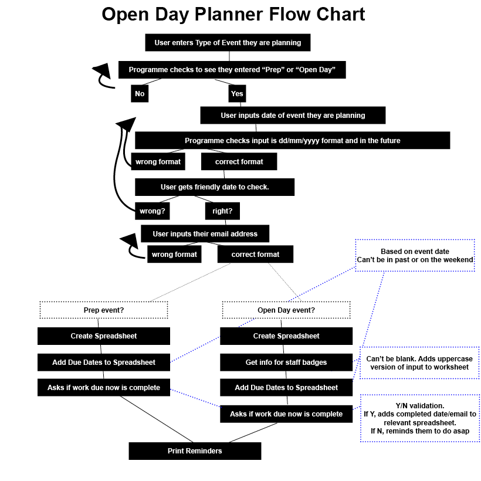
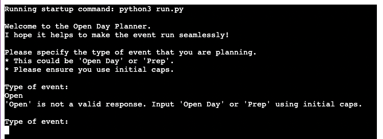
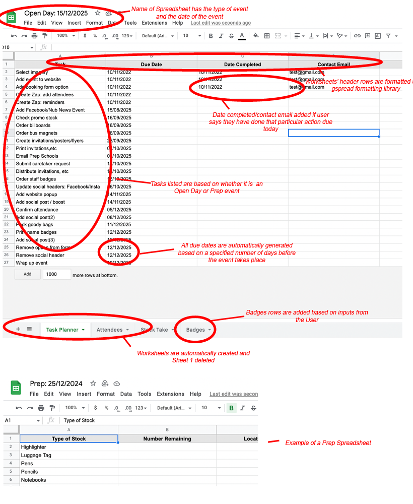
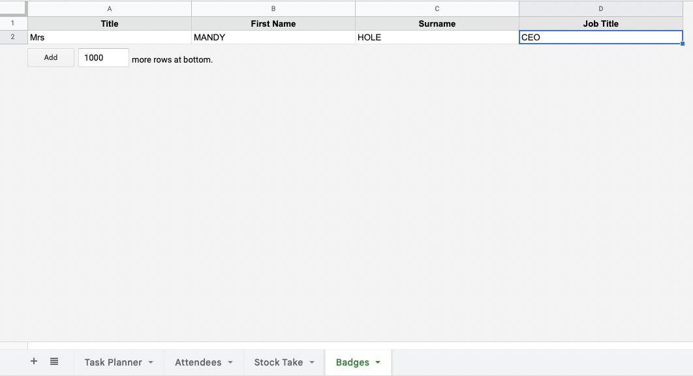
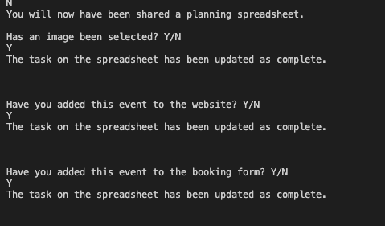
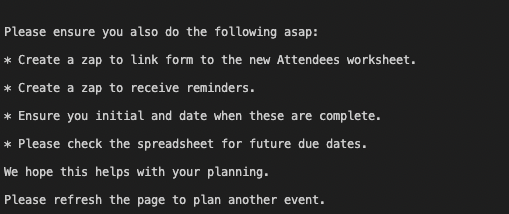
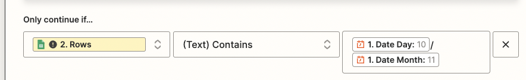

# Open Day Planner

## Overview

This site is designed specifically to help my colleagues and me to save time and be more efficient when implementing the marketing plan of certain events we offer through our work. Adding the type and date of the event will result in a Google spreadsheet for the event (containing a Tasks planner and other worksheets to update) containing due dates that get automatically generated and calculated relative to the date of the event itself. Historically we have sometimes forgetten to do the odd task but at the same time do not have the time to manually add in a long series of reminders either; this programme when combined with a Zapier zap (steps outlined below) addresses these issues. Whilst the main content is overall designed to add efficiency to my work, for the purpose of this project a few modications were made to 1 maintain anonymity 2 make the project more complex (e.g., adding staff name badges / requesting an email address) and 3 requesting an email also has the desired effect of ensuring we don't get test spreadsheets shared with our work emails automatically.

Should someone else want to use it to plan their event(s), they could use the basic framework by <a href="https://docs.github.com/en/get-started/quickstart/fork-a-repo" target="new" aria-label="How to fork a repo - opens in a new window">making a fork for the github repository</a> and then using that to make modifications to the types of events allowed, panda dataframes and reminder lengths. They then can use the guide below for creating the necessary zap to generate their own email reminders that get automatically set at a specified time should the current date match a due date in the spreadsheet. By doing this, they can create their own useful planning system.

## Flowchart

## Features

<strong>Type of event verification:</strong> The programme checks the user input either "Prep" or "Open Day"

<strong>Date verification:</strong> The programme checks the user input a date using dd/mm/yyyy format and that the date is in the future. It then returns the date in a user-friendly format so the user can verify that the date is correct. If not, they are asked to input the correct date.

<strong>Email verification:</strong> The programme checks the user input a valid email address.

<strong>Spreadsheet creation:</strong> A Google spreadsheet is created to help plan the event based on the type of event the user input using the Panda dataframes for data.

<strong>Name badges:</strong> The programme allows the user to add the information of any new staff who need badges into the system with the information populated formatted as all caps and added as a new row in the Badges worksheet (Open Day event only). It ensures that a response is given for each input.

Badge validation process example:

<strong>Generated Due Dates:</strong> The programme automatically creates a series of due dates to help the user to remember what they have to do at a particular date in relation to the date of the event by giving the number of days before the event that it needs to happen (or using a negative number will get a date after the event). The reminders cannot be in the past or fall on a weekend. See above worksheet screenshot for their use in situ.

<strong>Prompts for tasks due:</strong> The programme automatically creates a series of prompts to ask if the user has done the task that is due currently. If they have, the completed date and entered email are entered into the relevent tasts spreadsheet (see worksheet example above). If they haven't, then they are reminded to do so asap. A Y/N validation is used so only "Y" or "N" will work and will loop until one is provided. The programme also reminds the user to create zaps as they couldn't have done it until the programme generated the spreadsheet. The reminders are done with a delay to make sure the user has a chance to read them and doesn't miss anything.

## Setting up the Zap on Zapier
<strong><em>This will give you email reminders on the days where you have an action due</em></strong>

Step 1: If you haven't already, create a Zapier account at https://zapier.com/
Step 2: Create a new zap
Step 3: Set up your trigger (Schedule by Zapier)
<ul><li>Select every day</li>
<li>Decide if you want it to run on weekends</li>
<li>Choose a time</li>
<li>Test the trigger</li></ul>

Step 4: Set up your action (Google Sheets)
<ul><li>Event: Get Many Spreadsheet Rows (Advanced, output as Line Items)</li>
<li>Choose your Google Account</li>
<li>Choose the Drive</li>
<li>Choose the Spreadsheet</li>
<li>Choose the Worksheet</li>
<li>Columns A:Z</li>
<li>Row Count: Greater than your number of rows</li>
<li>First Row: 2</li>
<li>Success: No</li>
<li>Test the action</li>
</ul>

Step 5: Add a filter (Filter by Zapier)
Use these options:

Step 6: Create Action (Send Email in Gmail)
<ul><li>App: Gmail</li>
<li>Event: Send Email</li>
<li>Choose Account</li>
<li>Add to email</li>
<li>Add from email</li>
<li>Add from name</li>
<li>Add reply to email</li>
<li>Add subject</li>
<li>Copy link to spreadsheet and paste task planner info into body</li>
<li>Label/Mailbox: Inbox</li>
<li>Test the action</li>
</ul>

<em>This zap can now be duplicated so you can just update the spreadsheet/worksheet/body of your email</em>
## Testing

At each stage, I tested to ensure that each validation produced the expected result (e.g., intentionally adding dates in the past, wrong type of event, wrong email format, not putting Y or N, etc), either looping to ask the user for a correct input with the appropriate error or progressing the user through the programme if the input was correct. 

I checked to ensure the spreadsheets were in a clear, usable format with the cells labeled as expected and headers formatted and that the right cells were being updated as expected.

I also went through the 'Problems' section of the console and the pycodestyle to ensure there were no errors. I found that it didn't like the escape character in the email validation. A search found that adding an 'r' before the string made the program ignore that character and pass the test. The 80 character line length also caused problems until a search found that an escape character at the end of the line would split the lines and make them still work.

I also checked for user experience. In particular, I noticed that the programme seemed to be paused (or even broken) when the spreadsheet was being created as it took some time to generate. I therefore added the print message "Please be patient as the spreadsheet is created...". I also noticed that the multiple print statements at the end came out too fast and could be easily missed so I added a pause between statements using asyncio. In general, I also tested the input specifications to ensure that the instructions are clear from the outset and that any error messages resulting from incorrect input are helpful so the user can enter a valid response.

Finally, I did multiple tests to make sure my zap emails only went through as expected, ensuring that the dates matched the spreadsheet and didn't produce any false positives/negatives; this resulted in me omitting the year from my zap filter. As we don't plan events multiple years in the future, it was not an issue for the sake of the issue I am aiming to solve.

### Validator Testing
<strong>pycodestyle (formerly called pep8)</strong>: No errors were returned when passing through the <a href="https://pypi.org/project/pycodestyle/#:~:text=pycodestyle%20is%20a%20tool%20to,style%20conventions%20in%20PEP%208.&text=This%20package%20used%20to%20be,to%20pycodestyle%20to%20reduce%20confusion." target="new" aria-label="Info about Pycodestyle; opens in a new window">pycodestyle validator</a> once the line length, trailing whitespaces, double space above functions and escape character issues were resolved. I ran pycodestyle by running "pip install pycodestyle" in the terminal and then "pycodestyle --first run.py" until no errors appeared.

## Deployment
The site was deployed to Heroku. The steps to deploy are as follows:
<ol>
<li>Create a new app in Heroku</li>
<li>Add Config Vars for creds.json, credentials.json and Port 8000 </li>
<li>Add Buildpacks for python and nodejs (in that order)</li>
<li>Deploy by connecting to the Github repository</li>
<li>Set up automatic deploys</li>
</ol>
The live link can be found here <a href="https://open-day-planner.herokuapp.com/" target="new" aria-label="Open Day Planner in Heroku (opens in new window)">https://open-day-planner.herokuapp.com/</a>

## Credits

### Working with dates:
<ul><li><a href="https://theprogrammingexpert.com/check-if-string-is-date-in-python/#:~:text=To%20check%20if%20a%20string,string%20and%20a%20date%20format.&text=When%20working%20with%20strings%20in,date%20can%20be%20very%20useful" aria-label="The programming expert website (opens in a new window)" target="new">Programming Expert Website: checking input is a date in Python</a></li>

<li><a href="https://theprogrammingexpert.com/python-remove-time-from-datetime/#:~:text=To%20remove%20the%20time%20from,a%20date%20using%20date().&text=You%20can%20also%20use%20strftime,datetime%20object%20without%20the%20time" aria-label="The programming expert website (opens in a new window)" target="new">Programming Expert Website: removing time from Datetime</a></li>

<li><a href="https://stackoverflow.com/questions/7239315/cant-compare-datetime-datetime-to-datetime-date" aria-label="Stack Overflow website (opens in a new window)" target="new">Stack Overflow Website: comparing datetime-datetime to datetime-date</a></li>

<li><a href="https://docs.python.org/3/library/datetime.html#datetime.datetime.weekday" aria-label="Python.org website (opens in a new window)" target="new">Python.org: getting weekday from date</a></li>
</ul>

### Email Entry validation:
<ul><li><a href="https://www.tutorialspoint.com/python-program-to-validate-email-address" aria-label="Tutorials Point website (opens in a new window)" target="new">Tutorials Point Website: validating email address</a> <em>(this produces an error in pycodestyle)</em></li>

<li><a href="https://www.includehelp.com/python/ignoring-escape-sequences-in-the-string.aspx#:~:text=To%20ignoring%20escape%20sequences%20in,%22r%22%20before%20the%20string." aria-label="Include Help website (opens in a new window)" target="new">Include Help website: how to ignore escape character in a string</a> <em>(this fixes error in pycodestyle from above)</em></li>
</ul>

### Working with Google Sheets and Pandas
<ul><li><a href="https://medium.com/@jb.ranchana/write-and-append-dataframes-to-google-sheets-in-python-f62479460cf0" aria-label="Medium website (opens in a new window)" target="new">Medium Website: append dataframes to Google Sheets</a></li>

<li>Love Sandwiches Github Project: Credentials Code</a></li>

<li><a href="https://github.com/robin900/gspread-formatting" aria-label="Github website (opens in a new window)" target="new">Github (robin900): formatting Google spreadsheet through Python</a></li>

<li><a href="https://www.digitalocean.com/community/tutorials/update-rows-and-columns-python-pandas" aria-label="Digital Ocean website (opens in a new window)" target="new">Digital Ocean: updating rows and columns using pandas</a></li>

<li><a href="https://docs.gspread.org/en/latest/user-guide.html" aria-label="Gspread Userguide website (opens in a new window)" target="new">Gspread User Guide: general reference for using gspread</a></li>
</ul>

### Working with Asyncio
<ul><li><a href="https://docs.python.org/3/library/asyncio.html" aria-label="Python.org Website (opens in a new window)" target="new">Python.org: asyncio</a></li></ul>

## Python Libraries Used

<ul><li><strong>datetime, date, timedelta: </strong>Enables users to check an input was a valid date, find the date/time now, add/subtract units of time from a date</li>
<li><strong>re: </strong>Enables the program to check whether a string was a valid email address</li>
<li><strong>asyncio: </strong>Enables the programme to add a pause inbetween print statements</li>
<li><strong>gspread: </strong>Enables the programme to link to Google Sheets</li>
<li><strong>pandas as pd: </strong> Enables the creation of dataframes</li>
<li><strong>from gspread_dataframe import set_with_dataframe: </strong>Enables user to add panda dataframes to the Google Sheet</li>
<li><strong>from google.oauth2.service_account import Credentials: </strong>Enables authentication to Google Drive</li>
<li><strong>from gspread_formatting import *: </strong>Enables users to specify formatting for their Google Sheets within Python</li></ul>
